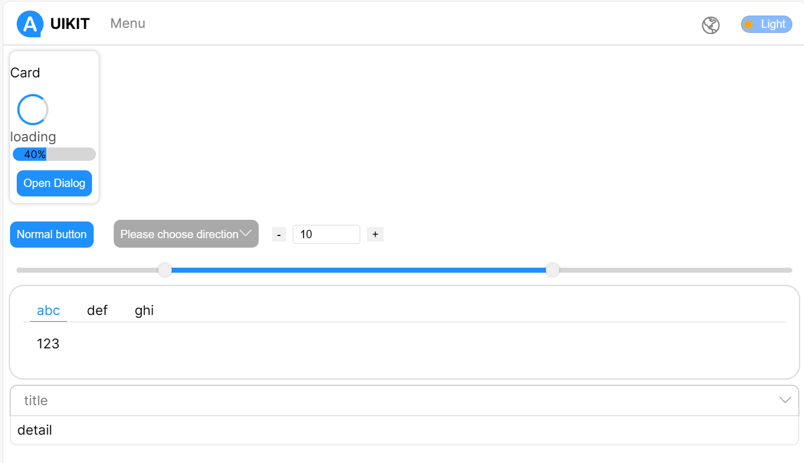

This is a demonstrated project for React based UI Kit experience.

# UI Kit



## Document

[中文](./docs/zh-cn/readme.md)

### hooks

* [useIoC](./docs/hooks/useIoC.md) Dependence Injection tool based on React useContext.
* [useI18n](./docs/hooks/useI18n.md) Internationalization tool based on useIoC.
* [useResource](./docs/hooks/useResource.md) Declarative RESTful API tool based on Typescript Decorator.
* [useTheme](./docs/hooks/useTheme.md) Theme tool based on CSS3 properties.
* [useStyle](./docs/hooks/useStyle.md) Style tool based on useIoC.

### components

Just run the storybook tool

```bash
npm storybook
# or
yarn storybook
# or
pnpm storybook
```

Open [http://localhost:6006](http://localhost:6006) with your browser to see the components.

## Getting Started

First, run the development server:

```bash
npm run dev
# or
yarn dev
# or
pnpm dev
```

Open [http://localhost:3000](http://localhost:3000) with your browser to see the result.
