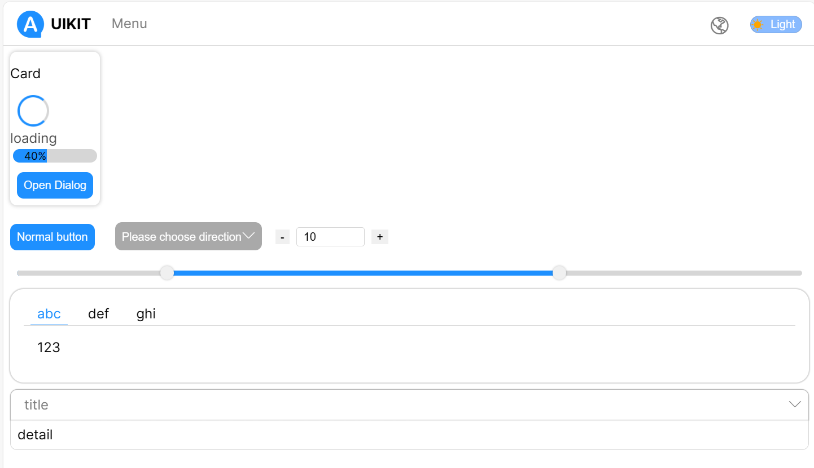

基于 React 的 UI库 示例项目

# UI库



## 文档

[English](../../README.md)

### hooks

* [useIoC](./useIoC.md) 基于 `React` `useContext` 的依赖注入工具。
* [useI18n](./useI18n.md) 基于 `useIoC` 国际化工具。
* [useResource](./useResource.md) 基于 `Typescript` 装饰器的声明式 RESTful API 工具
* [useTheme](./useTheme.md) 基于 `CSS3` 属性的主题工具.
* [useStyle](./useStyle.md) 基于 `useIoC` 的样式工具.

### 组件使用说明

运行 storybook 工具

```bash
npm storybook
# or
yarn storybook
# or
pnpm storybook
```

在浏览器中打开 [http://localhost:6006](http://localhost:6006) 查看组件使用说明。

## Getting Started

首先，运行开发服务器:

```bash
npm run dev
# or
yarn dev
# or
pnpm dev
```

在浏览器中打开 [http://localhost:3000](http://localhost:3000) 查看结果。
